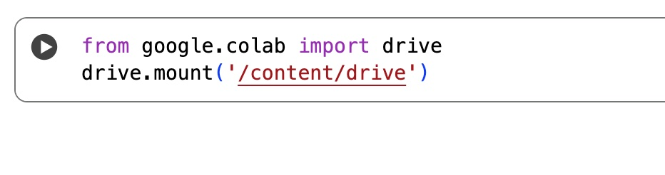
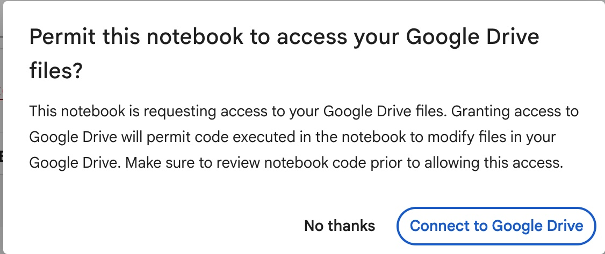
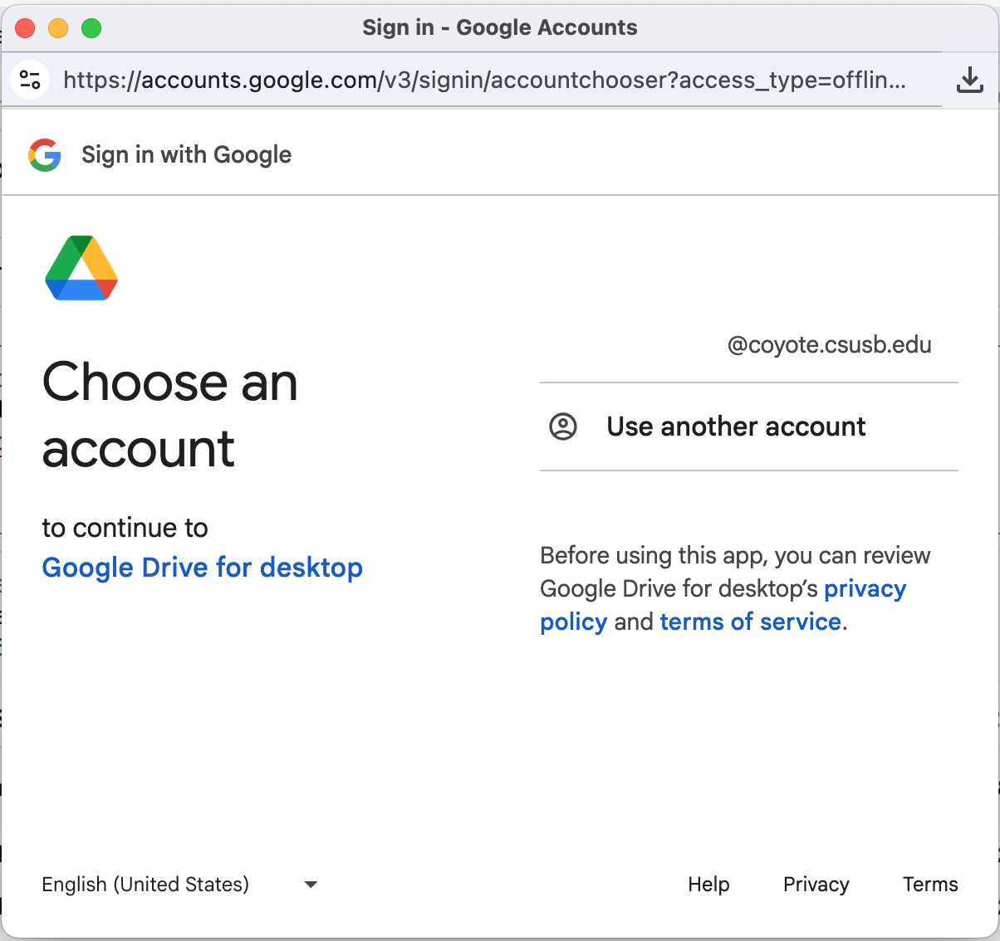
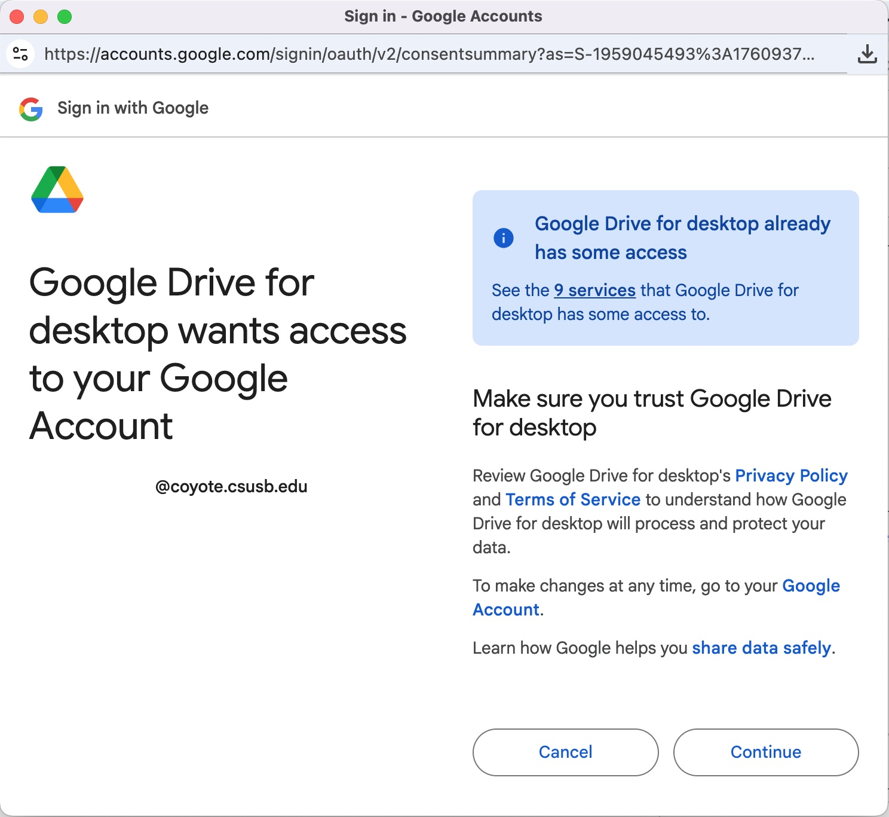
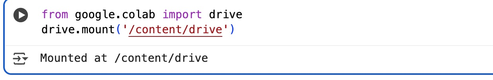

# Access Google Drive files in Google Colab

This is a brief guide showing you how to use Google Colab to access Google Drive files.

You should be able to do this with your CSUSB account. 

If you are having trouble executing the steps in this guide, go to the [CSUSB Information Technology Services (ITS) website](https://www.csusb.edu/its) to submit a support ticket. Give them details about the issue and the errors you are seeing. You can also visit them in person at PL-1108.

## 1. Run the code cell in the Google Colab notebook

Review the notebook code. Run the code cell that contains the following code to mount the drive:

```
    from google.colab import drive
    drive.mount('/content/drive')
```

This cell should be the first cell in the notebook (or one that appears before the cells that read or edit files located in Google Drive folders).



## 2. Go through the authorization steps

When you run the cell, a prompt will show up asking you to permit the notebook access to your Google Drive files. Select **Connect to Google Drive**.



Choose the account you want to use. Your CSUSB account (account with the @coyote.csusb.edu address) should be available as an option.



Select **Continue** to sign in to Google Drive with the account you selected in the previous step.


Review the services that Google Drive for Desktop has access to. Select **Continue** to allow Google Drive access to your Google account.



## 3. Review the code cell output

You should see the output `Mounted at /content/drive` after successful authentication.



Now you can access files under `/content/drive/MyDrive/`.

For example:
```
import pandas as pd
customer_data = pd.read_csv('/content/drive/MyDrive/Colab Notebooks/customer.csv')
```
